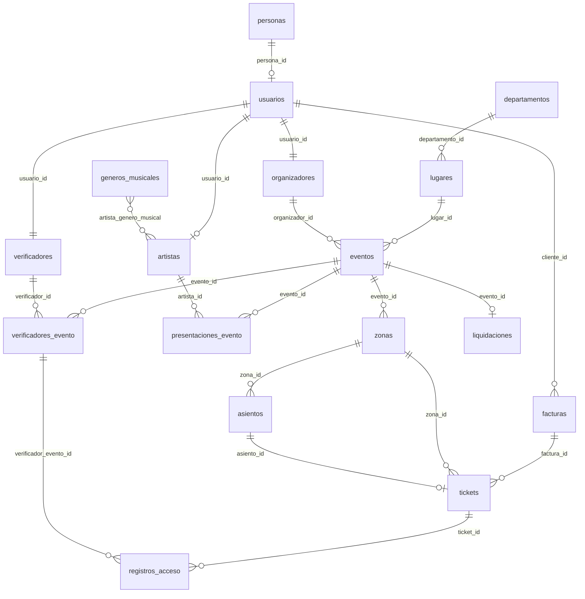

# Estructura de base de datos — MisterTicket Backend

Documento de referencia para retomar el proyecto. Describe las tablas, relaciones y convenciones del esquema en **PostgreSQL**, gestionado con **Django 5** y `AUTH_USER_MODEL = usuarios.Usuario`.

**Apps activas:** `usuarios` · `eventos` · `tickets` · `pagos`  
**Motor:** PostgreSQL (`DB_NAME`, `DB_USER`, etc. en `.env`)

---

## Vista general (relaciones)



---

## Convenciones globales

### Soft delete

Casi todos los modelos de negocio heredan de `SoftDeleteModel` (`usuarios.models`):

| Campo        | Tipo        | Uso                                      |
|-------------|-------------|------------------------------------------|
| `deleted_at`| `datetime`  | `NULL` = activo; con valor = eliminado   |

- `Modelo.objects.all()` → solo registros activos  
- `Modelo.all_objects.all()` → incluye eliminados  
- `delete()` → soft delete; `hard_delete()` → borrado real  

### Timestamps habituales

En la mayoría de tablas: `created_at`, `updated_at` (`auto_now_add` / `auto_now`).

### Usuario del sistema

Tabla **`usuarios`** (modelo `Usuario`, extiende `AbstractUser`).

| Campo extra     | Relación / notas                          |
|-----------------|-------------------------------------------|
| `email`         | Único                                     |
| `persona_id`    | FK → `personas` (opcional, `SET_NULL`)    |
| `created_at`    |                                           |
| `updated_at`    |                                           |

Campos heredados de Django: `username`, `password`, `first_name`, `last_name`, `is_staff`, `is_active`, `is_superuser`, `date_joined`, `last_login`, etc.

### Roles y permisos (estilo Spatie)

No hay tablas propias de “rol”. Se usan las de Django:

| Tabla Django              | Uso en MisterTicket                          |
|---------------------------|----------------------------------------------|
| `auth_group`              | Roles: `organizador`, `verificador`, `artista` |
| `auth_permission`         | Permisos del modelo `Usuario` + built-in   |
| `usuarios_groups`         | Usuario ↔ grupo (rol)                        |
| `usuarios_user_permissions` | Permisos directos al usuario               |

**Permisos custom** (codename en app `usuarios`):

| Codename             | Descripción breve                    |
|----------------------|--------------------------------------|
| `gestionar_eventos`  | CRUD de eventos                      |
| `verificar_tickets`  | Escanear/validar en puerta           |
| `gestionar_artistas` | Administrar perfiles de artista      |
| `ver_reportes`       | Reportes financieros / ventas        |

Se crean/actualizan tras cada `migrate` vía señal `post_migrate` en `usuarios/apps.py`.

---

## App: `usuarios`

### `personas`

Datos personales separados del login (SRP).

| Columna      | Tipo           | Restricciones   |
|-------------|----------------|-----------------|
| `id`        | bigint PK      |                 |
| `nombre`    | varchar(255)   |                 |
| `ci`        | varchar(20)    | **UNIQUE**      |
| `deleted_at`| timestamptz    | nullable        |
| `created_at`| timestamptz    |                 |
| `updated_at`| timestamptz    |                 |

### `usuarios`

Cuenta de acceso (JWT / admin). Ver sección “Usuario del sistema”.

### `artistas`

Perfil público de artista; puede existir sin cuenta (`usuario_id` null).

| Columna            | Tipo           | Restricciones        |
|-------------------|----------------|----------------------|
| `id`              | bigint PK      |                      |
| `nombre_artistico`| varchar(255)   |                      |
| `biografia`       | text           | nullable             |
| `foto`            | varchar (path) | nullable; `media/artistas/fotos/` |
| `usuario_id`      | FK → usuarios  | nullable, `SET_NULL` |
| `deleted_at`      | timestamptz    |                      |
| `created_at`      | timestamptz    |                      |
| `updated_at`      | timestamptz    |                      |

### `artista_genero_musical` (M2M)

| Columna             | Tipo        |
|--------------------|-------------|
| `artista_id`       | FK artistas |
| `generomusical_id` | FK generos_musicales |

### `organizadores`

Datos fiscales/bancarios del organizador de eventos.

| Columna          | Tipo           | Restricciones              |
|-----------------|----------------|----------------------------|
| `id`            | bigint PK      |                            |
| `razon_social`  | varchar(255)   |                            |
| `nit_rfc`       | varchar(50)    |                            |
| `banco_nombre`  | varchar(100)   |                            |
| `cuenta_bancaria`| varchar(50)   |                            |
| `usuario_id`    | FK → usuarios  | **UNIQUE**, `CASCADE`      |
| `deleted_at`    | timestamptz    |                            |
| `created_at`    | timestamptz    |                            |
| `updated_at`    | timestamptz    |                            |

### `verificadores`

Personal de control en entrada.

| Columna      | Tipo           | Restricciones         |
|-------------|----------------|-----------------------|
| `id`        | bigint PK      |                       |
| `pago`      | decimal(10,2)  |                       |
| `estado`    | varchar(50)    | default `activo`      |
| `usuario_id`| FK → usuarios  | **UNIQUE**, `CASCADE` |
| `deleted_at`| timestamptz    |                       |
| `created_at`| timestamptz    |                       |
| `updated_at`| timestamptz    |                       |

---

## App: `eventos`

### `departamentos`

Regiones (ej. departamentos de Bolivia).

| Columna   | Tipo         | Restricciones |
|----------|--------------|---------------|
| `id`     | bigint PK    |               |
| `nombre` | varchar(100) | **UNIQUE**    |
| + soft delete y timestamps |

### `lugares`

Venues / recintos.

| Columna           | Tipo              | Restricciones      |
|------------------|-------------------|--------------------|
| `id`             | bigint PK         |                    |
| `nombre`         | varchar(255)      |                    |
| `direccion`      | text              |                    |
| `capacidad_total`| positive int      |                    |
| `departamento_id`| FK → departamentos| `PROTECT`          |
| + soft delete y timestamps |

### `generos_musicales`

| Columna   | Tipo         | Restricciones |
|----------|--------------|---------------|
| `id`     | bigint PK    |               |
| `nombre` | varchar(100) | **UNIQUE**    |
| + soft delete y timestamps |

### `eventos`

Concierto o show principal.

| Columna          | Tipo              | Restricciones / valores típicos        |
|-----------------|-------------------|----------------------------------------|
| `id`            | bigint PK         |                                        |
| `nombre`        | varchar(255)      |                                        |
| `estado`        | varchar(50)       | default `borrador` → `publicado`, `en_curso`, `finalizado`, `cancelado` |
| `lugar_id`      | FK → lugares      | `PROTECT`                              |
| `organizador_id`| FK → organizadores| `PROTECT`                              |
| `fecha_inicio`  | timestamptz       | nullable                               |
| `fecha_fin`     | timestamptz       | nullable                               |
| + soft delete y timestamps |

### `zonas`

Sectores de venta dentro de un evento (VIP, General, etc.).

| Columna               | Tipo              | Restricciones     |
|----------------------|-------------------|-------------------|
| `id`                 | bigint PK         |                   |
| `nombre`             | varchar(100)      |                   |
| `precio`             | decimal(10,2)     |                   |
| `capacidad_max`      | positive int      |                   |
| `entradas_disponibles`| positive int     |                   |
| `es_numerada`        | boolean           | default `false`   |
| `evento_id`          | FK → eventos      | `CASCADE`         |
| + soft delete y timestamps |

### `asientos`

Solo si `zona.es_numerada = true`.

| Columna   | Tipo         | Restricciones                          |
|----------|--------------|----------------------------------------|
| `id`     | bigint PK    |                                        |
| `fila`   | positive int | **UNIQUE** con `columna` + `zona_id`   |
| `columna`| positive int |                                        |
| `estado` | varchar(50)  | default `disponible` → `reservado`, `ocupado` |
| `zona_id`| FK → zonas   | `CASCADE`                              |
| + soft delete y timestamps |

### `presentaciones_evento`

Cartelera: qué artista toca en qué orden.

| Columna           | Tipo              | Restricciones   |
|------------------|-------------------|-----------------|
| `id`             | bigint PK         |                 |
| `evento_id`      | FK → eventos      | `CASCADE`       |
| `artista_id`     | FK → artistas     | `CASCADE`       |
| `orden_aparicion`| positive int      | orden en show   |
| `tiempo_inicio`  | timestamptz       |                 |
| + soft delete y timestamps |

### `verificadores_evento`

Asignación verificador ↔ evento.

| Columna         | Tipo                | Restricciones                    |
|----------------|---------------------|----------------------------------|
| `id`           | bigint PK           |                                  |
| `evento_id`    | FK → eventos        | `CASCADE`                        |
| `verificador_id`| FK → verificadores | `CASCADE`                        |
| + **UNIQUE** (`evento_id`, `verificador_id`) |
| + soft delete y timestamps |

### `registros_acceso`

Log de cada intento de validación de ticket en puerta.

| Columna                | Tipo                      | Restricciones |
|-----------------------|---------------------------|---------------|
| `id`                  | bigint PK                 |               |
| `resultado`           | varchar(50)               | `aprobado`, `rechazado`, `ya_usado`, `invalido` |
| `verificador_evento_id`| FK → verificadores_evento| `CASCADE`     |
| `ticket_id`           | FK → tickets              | `CASCADE`     |
| + soft delete y timestamps |

---

## App: `tickets`

### `facturas`

Compra agrupada de uno o más tickets.

| Columna       | Tipo           | Restricciones                          |
|--------------|----------------|----------------------------------------|
| `id`         | bigint PK      |                                        |
| `precio`     | decimal(10,2)  | total de la compra                     |
| `estado_pago`| varchar(50)    | default `pendiente` → `pagado`, `reembolsado`, `cancelado` |
| `cliente_id` | FK → usuarios  | `PROTECT`                              |
| + soft delete y timestamps |

### `tickets`

Entrada individual con QR.

| Columna      | Tipo           | Restricciones                              |
|-------------|----------------|--------------------------------------------|
| `id`        | bigint PK      |                                            |
| `codigo_qr` | varchar(255)   | **UNIQUE**                                 |
| `estado`    | varchar(50)    | default `activo` → `usado`, `cancelado`, `expirado` |
| `asiento_id`| FK → asientos  | nullable, **UNIQUE**, `SET_NULL` (null si zona no numerada) |
| `zona_id`   | FK → zonas     | `PROTECT`                                  |
| `factura_id`| FK → facturas  | `PROTECT`                                  |
| + soft delete y timestamps |

---

## App: `pagos`

### `liquidaciones`

Pago al organizador tras el evento (comisión plataforma vs. neto).

| Columna                    | Tipo           | Restricciones                          |
|---------------------------|----------------|----------------------------------------|
| `id`                      | bigint PK      |                                        |
| `monto_total_ventas`      | decimal(12,2)  |                                        |
| `monto_comision_plataforma`| decimal(12,2) |                                        |
| `monto_pago_organizador`  | decimal(12,2)  |                                        |
| `referencia_bancaria`     | varchar(255)   | nullable                               |
| `estado`                  | varchar(50)    | default `pendiente` → `procesando`, `completado`, `fallido` |
| `evento_id`               | FK → eventos   | **UNIQUE** (1 liquidación por evento), `PROTECT` |
| + soft delete y timestamps |

> **Nota:** El modelo existe en código (`apps/pagos/models.py`). Si acabas de añadir la app, ejecuta `makemigrations pagos` y `migrate` (o el reset descrito en `README.md`).

---

## Flujo de datos (resumen mental)

1. **Organizador** crea **Evento** en un **Lugar** → define **Zonas** (y opcionalmente **Asientos**).
2. **Artistas** se vinculan al evento vía **PresentacionEvento**; géneros vía M2M.
3. **Cliente** (`Usuario`) compra → **Factura** + N **Tickets** (QR, zona, asiento opcional).
4. **Verificador** asignado al evento (**VerificadorEvento**) escanea ticket → **RegistroAcceso**.
5. Al cerrar ventas, **Liquidacion** registra montos y estado de pago al organizador.

---

## Tablas Django / sistema (no definidas en `models.py` locales)

| Tabla / prefijo              | Uso                                      |
|-----------------------------|------------------------------------------|
| `django_migrations`         | Historial de migraciones                 |
| `django_content_type`       | Tipos para permisos                      |
| `django_session`            | Sesiones (admin, etc.)                   |
| `auth_group`, `auth_permission` | Grupos y permisos                    |
| `usuarios_groups`           | Usuario ↔ rol                            |

---

## API REST (mapeo rápido tabla → prefijo URL)

| Prefijo API              | Tablas principales                          |
|-------------------------|---------------------------------------------|
| `/api/usuarios/`        | usuarios, personas, artistas, organizadores, verificadores |
| `/api/eventos/`         | departamentos, lugares, generos, eventos, zonas, asientos, presentaciones, verificadores_evento, registros_acceso |
| `/api/tickets/`         | facturas, tickets                           |
| `/api/pagos/`           | liquidaciones                               |

Autenticación: `POST /api/usuarios/login/` (JWT access + refresh + objeto `usuario`).

---

## Comandos útiles

```bash
# Ver SQL de una migración
python manage.py sqlmigrate usuarios 0001

# Shell con modelos cargados
python manage.py shell

# Listar tablas en PostgreSQL (psql)
\dt
```

Migraciones y reset de BD: ver [`README.md`](./README.md).

---

*Última revisión según modelos en `apps/*/models.py`. Actualiza este archivo si añades tablas o cambias relaciones.*
